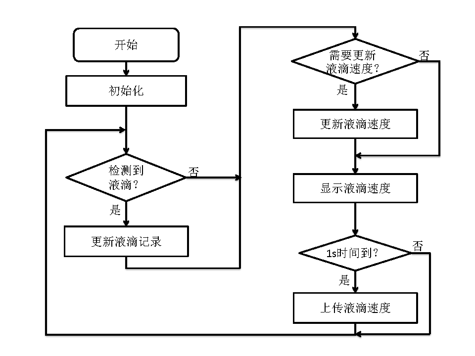
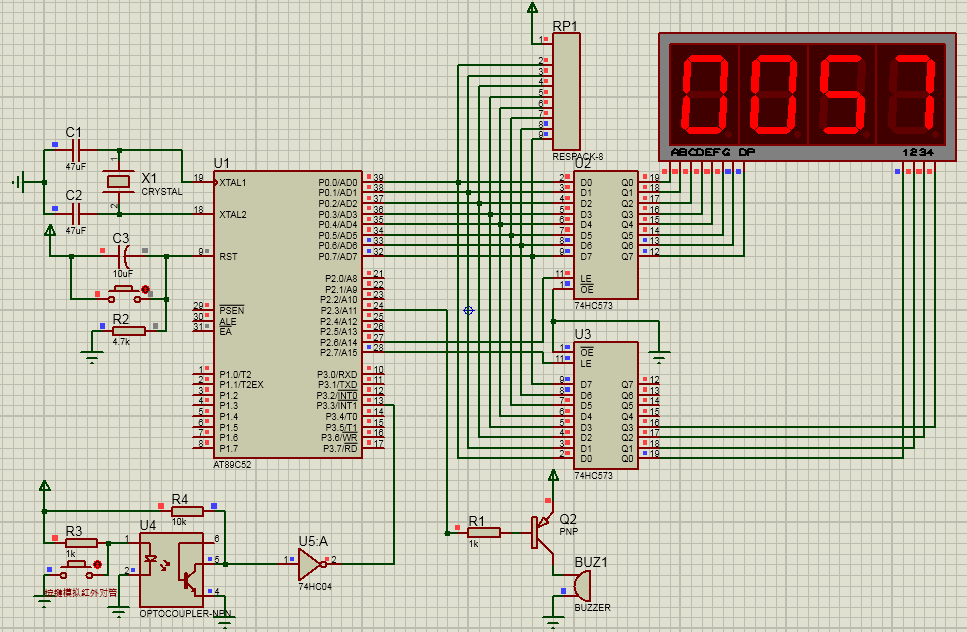
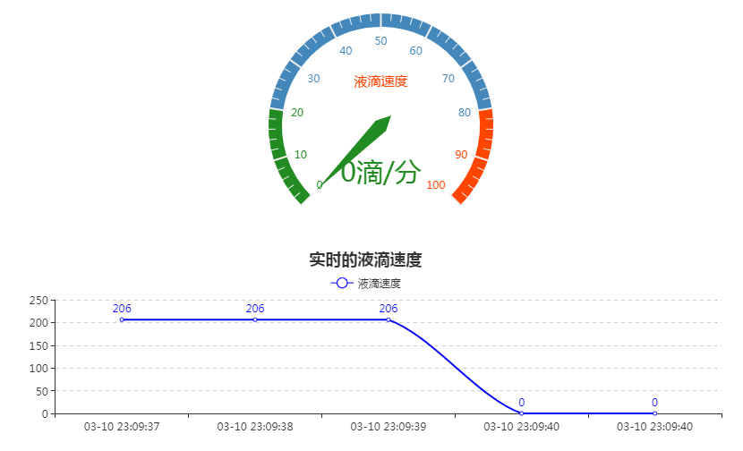

# 基于单片机的自动输液监测装置

## 功能需求

本课题的需求是设计并实现能够实时监测输液速度，反馈信息到主机并当液体输完能自动报警的输液装置。

## 系统模块

- 单片机选用：STC89C52
- 液滴检测传感器：红外对管
- 显示模块：七段数码管
- 报警模块：有源蜂鸣器
- 无线模块：ESP8266

## 主程序流程图

## Proteus 仿真效果图

## 功能实现

事先给单片机下载好程序，打开电源，系统将会开始工作。首先是LED1灯亮，等待WIFI连接，
WIFI连接成功后LED1灯熄灭，LED2灯亮，等待获取IP，获得IP后LED2灯灭，LED3灯亮，此时
设置无线模块传输模式为透传模式，成功后LED3灯灭，系统检测液滴的到来。

## 液滴速度数据示例

## 项目源文件

本项目源文件存放在 source 文件夹下。

- 单片机相关IO引脚的定义：
  - "board_config.h"
- 七段数码管显示模块：
  - "digital_display.h"
  - "digital_display.c"
- 串口通信的初始化：
  - "uart.h"
  - "uart.c"
- ESP8266无线模块配置和数据上传：
  - "esp8266.h"
  - "esp8266.c"
- 主程序，调用各个模块，完成项目功能：
  - "main.c"
